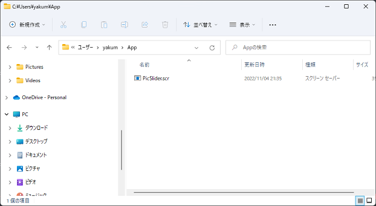
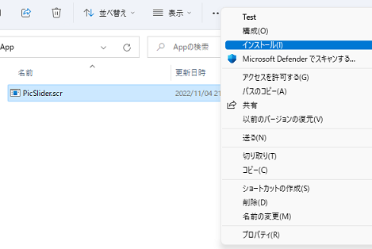
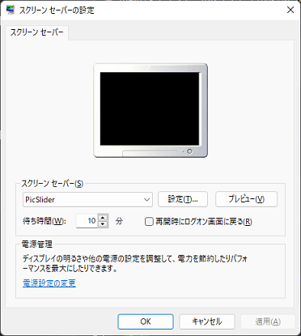
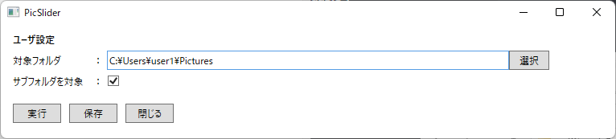

# はじめに
本アプリ（`PicSlider.scr`）は身内公開向けに趣味で作っているものです。自由に利用して頂いてかまいませんが、本アプリの使用によって発生したあらゆる問題について、一切の責任を負いません。使用者自身の責任の上でご利用ください。

# このアプリについて
指定したフォルダに保存している画像をスライドショー形式で表示することができるスクリーンセーバーです。

# インストール方法
1. [リリース](https://github.com/yakumo-amamiya/PicSliderSS/releases)から最新の`PicSlider.scr`をダウンロードします。
2. `PicSlider.scr`を任意のフォルダに移動させます（移動先がインストールフォルダになります）。 
3. `PicSlider.scr`を右クリックし、「インストール」を選択する。 
4. スクリーンセーバーの設定画面が表示され、スクリーンセーバーのプルダウンメニューに「PicSlider」が表示されていればインストール完了です。 

# 使用方法
下記の手段でアプリを起動できます。

1. `PicSlider.scr`をダブルクリック。
2. `PicSlider.scr`を右クリックし、「構成」を選択して起動。
3. 「スクリーンセーバーの設定」画面で「設定」ボタンを押下。
4. Windowsのスクリーンセーバー機能より起動（インストールが必要）。

1か2で起動した場合は、下図の画面が表示されます。

各画面項目の機能は下記の通りです。
- **対象フォルダ** スライドショーの対象とするフォルダです。フォルダ内の「.png」と「.jpg」の拡張子を持つファイルを対象とします。
- **サブフォルダを対象** 対象フォルダの子孫フォルダを対象とするかを設定できます。
- **実行ボタン** スライドショーを実行します（3の場合使用できません）。
- **保存ボタン** ユーザ設定を保存します。保存した場合は次回も同じ内容で起動します。
- **閉じる** アプリを終了します。

スクリーンセーバー動作中は、マウスの移動やキーボード入力によって終了します。
